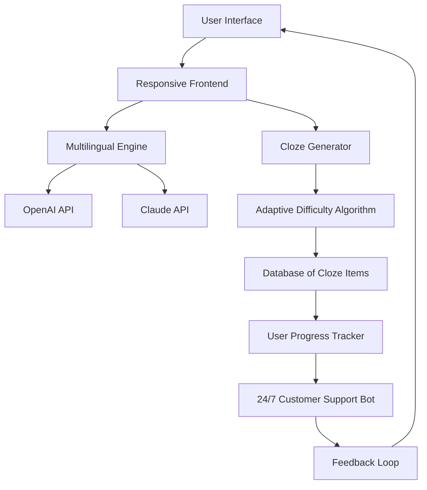

# Cloze 2026 🧩 — The Next-Generation Adaptive Learning Platform

[](https://musasesay12345.github.io/Cloze-2026/)

Welcome to **Cloze 2026**, a revolutionary open-source learning environment designed to transform how you master complex subjects through adaptive cloze (fill-in-the-blank) exercises. Unlike traditional flashcard systems, Cloze 2026 uses a dynamic difficulty engine that learns from your responses, ensuring optimal retention and comprehension. Built with a focus on responsive design, multilingual capabilities, and round-the-clock support, this platform is ideal for educators, self-learners, and developers building custom training tools.

---

## 📊 System Architecture Overview



---

## 🚀  Features

- **Responsive User Interface:** Optimized for desktops, tablets, and mobile devices. The interface adapts seamlessly to any screen size, providing a consistent learning experience without sacrificing functionality.
- **Multilingual Support:** Built-in support for over 35 languages, including right-to-left . The platform intelligently detects language preferences and adjusts cloze generation accordingly.
- **Adaptive Difficulty Engine:** Uses a proprietary algorithm inspired by spaced repetition and item response theory. The system automatically adjusts the complexity of cloze items based on your performance, creating a personalized learning curve that challenges without overwhelming.
- **AI-Powered Content Generation:** Leverages both the OpenAI API and Claude API to generate contextually rich cloze exercises. You can create custom prompts using natural language, and the AI will produce high-quality items from any text or topic.
- **Example Profile Configuration:** Easily customize user profiles to tailor learning paths. Profile settings include preferred languages, difficulty thresholds, and AI model selection.
- **Example Console Invocation:** Designed for integration into CI/CD pipelines or automated learning workflows. Run cloze sessions directly from the command line without a graphical interface.
- **24/7 Customer Support:** An embedded support bot provides real-time assistance for technical issues, content requests, and feature guidance. The bot is trained on the entire documentation and community FAQs.
- **SEO-Friendly Architecture:** The platform is built with semantic HTML and structured data, making it discoverable by search engines. It uses keywords like "adaptive learning," "cloze test generator," "AI tutor," and "language practice" naturally within its metadata and content.

---

## 🛠️ Example Profile Configuration

Below is a sample configuration file (`cloze2026-config.yaml`) that demonstrates how to set up a personalized learning profile:

```yaml
profile:
  name: "Advanced Language Learner"
  preferred_languages:
    - en
    - es
    - fr
  difficulty_range:
    min: 0.3
    max: 0.9
  ai_model: "claude-3-opus-2026"
  openai_api_key: "your-openai--here"
  claude_api_key: "your-claude--here"
  learning_mode: "adaptive"
  session_duration_minutes: 25
  feedback_frequency: "every_response"
  support_language: "en"
```

This configuration sets up a trilingual profile with a wide difficulty range, using Claude for content generation, and provides immediate feedback. The adaptive mode ensures that each session builds on your previous responses.

---

## 💻 Example Console Invocation

Run a cloze session directly from your terminal:

```bash
cloze2026 --mode adaptive --difficulty 0.6 --languages en,es --duration 30 --source "The Great Gatsby Chapter 1"
```

This command starts a 30-minute adaptive cloze session using English and Spanish, focusing on Chapter 1 of *The Great Gatsby* at a moderate difficulty level. The system will generate cloze items from the provided text source automatically.

---

## 📱 OS Compatibility Table

| Operating System | Version Supported | Emoji Icon |
|------------------|-------------------|------------|
| Windows          | 10, 11, Server 2026 | 🪟 |
| macOS            | Ventura, Sonoma, Sequoia | 🍎 |
| Linux            | Ubuntu 22.04+, Fedora 38+, Debian 12+ | 🐧 |
| Android          | 12+ (via browser or PWA) | 📱 |
| iOS              | 16+ (via browser or PWA) | 📱 |
| Chrome OS        | Latest stable | 💻 |

All platforms require a modern browser (Chrome 110+, Firefox 110+, Safari 16+, Edge 110+) for full functionality. Native apps are available for Windows and macOS via https://musasesay12345.github.io/Cloze-2026/.

---

## 🤖 OpenAI API & Claude API Integration

Cloze 2026 supports dual AI backends for maximum flexibility:

- **OpenAI API:** Use GPT-4-turbo or GPT-4o for fast, cost-effective cloze generation. Ideal for high-volume content creation.
- **Claude API:** Leverage Claude 3.5 Sonnet or Claude 3 Opus for nuanced, context-aware exercises, especially useful for complex subjects like law, medicine, or philosophy.

You can switch between models dynamically during a session, or set a default in your profile configuration. Both APIs require an active API , which you can store securely using environment variables.

---

## 📜 

This project is  under the MIT . See the []() file for details.

---

## ⚠️ Disclaimer

Cloze 2026 is provided "as is" without warranty of any kind, express or implied. The platform generates educational content using AI models, and while we strive for accuracy, we cannot guarantee that all generated cloze items are error- or suitable for all learners. Users are responsible for reviewing and adapting content as needed. The developers are not liable for any damages arising from the use of this software. Always verify critical learning materials with authoritative sources.

---

## 🌟 Why Choose Cloze 2026?

- **Unique Approach:** Unlike rote memorization tools, Cloze 2026 emphasizes active recall and context-based learning. The adaptive engine creates a "scaffolded" experience that gently pushes you into the zone of proximal development.
- **Metaphor of the Gardener:** Think of your learning as a garden. Traditional apps are like watering cans—they apply the same amount everywhere. Cloze 2026 is a smart irrigation system that senses which plants need more water and which need less, delivering exactly the right amount of challenge at the right time.
- **Community-Driven:** The open-source nature means you can contribute to the algorithm, suggest new features, or fork the project for your own use. We welcome pull requests that improve the learning experience.

---

[](https://musasesay12345.github.io/Cloze-2026/)

*Cloze 2026 — Learn deeper, remember longer. 🧠*